# Trustworthiness of Medical XAI

This repository includes detailed experimental results and full references of the paper [*Overlooked Trustworthiness of Explainability in Medical AI*](https://).

- [Overview of XAI Methods in Medical AI](#overview-of-xai-methods-in-medical-ai)
- [How to run the projects](#how-to-run-the-projects)
- [Dataset Information](#dataset-information)
- [More Training Details](#more-training-details)
    - [AI Model Training Details](#ai-model-training-details)
    - [Adversarial Training Details](#adversarial-training-details)
- [More Visualization Results](#more-visualization-results)
- [More Quantitative Results](#more-quantitative-results)
    - [Model Prediction Performance on 5 Categories](#model-prediction-performance-on-5-categories)
    - [Images' and Saliency Maps' Similarity Before and After Attack](#images-and-saliency-maps-similarity-before-and-after-attack)

## Overview of XAI methods in Medical AI

| XAI Methods | Description | Applications in MedAI |
| :--- | :---- | :---- |
| [Vanilla Grad](https://arxiv.org/abs/1312.6034) | It calculates the impact of pixels by approximating their respective gradient on the prediction.| [1] [Breast Mass Classification from Mammograms using Deep Convolutional Neural Networks](https://arxiv.org/pdf/1612.00542.pdf ). NIPS 2016 workshop   [2] [AI for Radiographic COVID-19 Detection Selects Shortcuts Over Signal](https://www.nature.com/articles/s42256-021-00338-7.pdf ). Nature Machine Intelligence, 2021: 1-10.   [3] [Iterative Augmentation of Visual Evidence for Weakly-Supervised Lesion Localization in Deep Interpretability Frameworks: Application to Color Fundus Images](https://ieeexplore.ieee.org/stamp/stamp.jsp?arnumber=9103111 ). IEEE TMI, 2020 Nov, 39(11): 3499-3511.  [4] [Artificial Intelligence System Reduces False-positive Findings in the Interpretation of Breast Ultrasound Exams](https://www.nature.com/articles/s41467-021-26023-2 ). Nature Communications, 2021, 12.   [5] [Assessing the Trustworthiness of Saliency Maps for Localizing Abnormalities in Medical Imaging](https://pubs.rsna.org/doi/pdf/10.1148/ryai.2021200267), Radiology: AI, 2021, 3(6): e200267.|
| [Grad x Input](https://arxiv.org/pdf/1605.01713.pdf) | This method is initially proposed to improve sharpness of attribution maps. It multiplies the vanila grad map with the input. | [1] [Testing the Robustness of Attribution Methods for Convolutional Neural Networks in MRI-based Alzheimer’s Disease Classification](https://arxiv.org/pdf/1909.08856.pdf). iMIMIC 2019.|
| [GradCAM](https://openaccess.thecvf.com/content_ICCV_2017/papers/Selvaraju_Grad-CAM_Visual_Explanations_ICCV_2017_paper.pdf) | It produces gradient-weighted class activation maps using the gradients of the target concept as it flows to the final convolutional layer. | [1] [Automatic Brain Tumor Grading from MRI Data Using Convolutional Neural Networks and Quality Assessment](https://arxiv.org/pdf/1809.09468.pdf). iMIMIC 2018.   [2] [Deep Neural Network or Dermatologist?](https://arxiv.org/pdf/1908.06612.pdf). iMIMIC 2019.   [3] [An Ensemble of Neural Networks Provides Expert-level Prenatal Detection of Complex Congenital Heart Disease](https://www.nature.com/articles/s41591-021-01342-5). Nature Medicine, 2021, 27(5): 882-891.   [4] [Detection of Anaemia from Retinal Fundus Images Via Deep Learning](https://www.nature.com/articles/s41551-019-0487-z ). Nature Biomedical Engineering, 2020, 4(1): 18-27.   [5] [Iterative Augmentation of Visual Evidence for Weakly-Supervised Lesion Localization in Deep Interpretability Frameworks: Application to Color Fundus Images](https://ieeexplore.ieee.org/stamp/stamp.jsp?arnumber=9103111 ). IEEE TMI, 2020, 39(11): 3499-3511.   [6] [Assessing the Trustworthiness of Saliency Maps for Localizing Abnormalities in Medical Imaging](https://pubs.rsna.org/doi/pdf/10.1148/ryai.2021200267), Radiology: AI, 2021, 3(6): e200267.|
| [Guided-GradCAM](https://arxiv.org/abs/1610.02391) | It combines the masks obtained by GradCAM and Guided-backprop in an attempt to minimize the false positive produced by either. | [1] [Interpretable Socioeconomic Status Inference from Aerial Imagery through Urban Patterns](https://www.nature.com/articles/s42256-020-00243-5). Nature Machine Intelligence, 2020, 2(11): 684-692.   [2] [Interpretable Classification of Alzheimer’s Disease Pathologies with a Convolutional Neural Network Pipeline](https://www.nature.com/articles/s41467-019-10212-1). Nature Communications, 2019, 10(1): 1-14.   [3] [Dual-Sampling Attention Network for Diagnosis of COVID-19 From Community Acquired Pneumonia](https://ieeexplore.ieee.org/abstract/document/9095328?casa_token=S3q8AObK5kUAAAAA:p9PSIEbrDmp5puisccoNkIxEjYl3y1GSSZqP_c_s4lbkkwQhnvFzMd6f0NOvntNk69ZekatsXg) IEEE TMI, 2020, 39(8): 2595-2605.   [4] [Iterative Augmentation of Visual Evidence for Weakly-Supervised Lesion Localization in Deep Interpretability Frameworks: Application to Color Fundus Images](https://ieeexplore.ieee.org/stamp/stamp.jsp?arnumber=9103111). IEEE TMI, 2020, 39(11): 3499-3511.   [5] [Assessing the Trustworthiness of Saliency Maps for Localizing Abnormalities in Medical Imaging](https://pubs.rsna.org/doi/pdf/10.1148/ryai.2021200267), Radiology: AI, 2021, 3(6): e200267.|
| [Integrated Gradients (IG)](http://proceedings.mlr.press/v70/sundararajan17a/sundararajan17a.pdf) | It computes the average gradient as the input is varied from the baseline (often zero) to the actual input value. | [1] [Using a Deep Learning Algorithm and Integrated Gradients Explanation to Assist Grading for Diabetic Retinopathy](https://www.sciencedirect.com/science/article/pii/S0161642018315756). Ophthalmology, 2019, 126(4): 552-564.   [2] [Detection of Anaemia from Retinal Fundus Images via Deep Learning](https://www.nature.com/articles/s41551-019-0487-z). Nature Biomedical Engineering, 2020, 4(1): 18-27.   [3] [AI for Radiographic COVID-19 Detection Selects Shortcuts over Signal](https://www.nature.com/articles/s42256-021-00338-7.pdf). Nature Machine Intelligence, 2021: 1-10.   [4] [Weakly Supervised Lesion Localization for Age-Related Macular Degeneration Detection using Optical Coherence Tomography Images](https://journals.plos.org/plosone/article?id=10.1371/journal.pone.0215076 ). PloS one, 2019, 14(4): e0215076.   [5] [Pathomic Fusion: An Integrated Framework for Fusing Histopathology and Genomic Features for Cancer Diagnosis and Prognosis](https://arxiv.org/pdf/1912.08937.pdf). IEEE TMI, 2021.   [6] [Iterative Augmentation of Visual Evidence for Weakly-Supervised Lesion Localization in Deep Interpretability Frameworks: Application to Color Fundus Images](https://ieeexplore.ieee.org/stamp/stamp.jsp?arnumber=9103111). IEEE TMI, 2020, 39(11): 3499-3511.   [7] [Explainable AI for Medical Imaging: Deep-Learning CNN Ensemble for Classification of Estrogen Receptor Status from Breast MRI](https://www.spiedigitallibrary.org/conference-proceedings-of-spie/11314/113140Z/Explainable-AI-for-medical-imaging--deep-learning-CNN-ensemble/10.1117/12.2549298.full). SPIE Medical Imaging 2020.   [8] [Assessing the Trustworthiness of Saliency Maps for Localizing Abnormalities in Medical Imaging](https://pubs.rsna.org/doi/pdf/10.1148/ryai.2021200267), Radiology: AI, 2021, 3(6): e200267.|
| [Smoothed Gradient (SG)](https://arxiv.org/abs/1706.03825 ) | An improvement on the gradient method which averages the gradient over multiple inputs with additional noise. | [1] [Detection of Anaemia from Retinal Fundus Images Via Deep Learning](https://www.nature.com/articles/s41551-019-0487-z ). Nature Biomedical Engineering, 2020, 4(1): 18-27.   [2] [Assessing the Trustworthiness of Saliency Maps for Localizing Abnormalities in Medical Imaging](https://pubs.rsna.org/doi/pdf/10.1148/ryai.2021200267), Radiology: AI, 2021, 3(6): e200267.   [3] [Explainable AI for Medical Imaging: Deep-Learning CNN Ensemble for Classification of Estrogen Receptor Status from Breast MRI](https://www.spiedigitallibrary.org/conference-proceedings-of-spie/11314/113140Z/Explainable-AI-for-medical-imaging--deep-learning-CNN-ensemble/10.1117/12.2549298.full). SPIE Medical Imaging 2020.   [4] [Prediction of Lung and Colon Cancer through Analysis of Histopathological Images by Utilizing Pre-trained CNN Models with Visualization of Class Activation and Saliency Maps](https://dl.acm.org/doi/pdf/10.1145/3442536.3442543). AICCC 2020.|
| [XRAI](https://openaccess.thecvf.com/content_ICCV_2019/papers/Kapishnikov_XRAI_Better_Attributions_Through_Regions_ICCV_2019_paper.pdf) | It builds on integrated gradients by starting with a baseline image and incrementally adding regions that offer maximal attribution gain. | [1] [Predicting Sex from Retinal Fundus Photographs Using Automated Deep Learning](https://www.nature.com/articles/s41598-021-89743-x). Nature Scientific Reports, 2021, 11(1): 1-8.   [2] [Assessing the Trustworthiness of Saliency Maps for Localizing Abnormalities in Medical Imaging](https://pubs.rsna.org/doi/pdf/10.1148/ryai.2021200267), Radiology: AI, 2021, 3(6): e200267.|

## How to run the projects
### Overview

The whole project includes three parts
**Part I** A case study to allow interested readers directly verify our method using provided sample data;
**Part II** The code for training deep neural networks on the CheXpert Dataset; and
**Part III** The code for generating images for evaluating relevance and resistance of different saliency methods.

### Part I

__Objective:__

To allow interested readers directly verify our method using provided sample data  

__File names:__

`Relevance_case_study.ipynb`
*(run this file to evaluate the **relevance** of all seven saliency methods)* 

`Resistance_case_study.ipynb`
*(run this file to evaluate the **resistance** of all seven saliency methods)*  

__Notes:__
The two image examples are originally generated for the relevance check (observation: Atelectasis, saliency map: VanillaBP) and resistance check (observation: Edema, saliency map: VanillaBP). The results on other saliency methods are similar to this one as reported in our main article. If you would like to have more images, you can run the code included in *Part III* below to generate images for the saliency methods.

### Part II  

__Objective:__

To train deep neural networks on the CheXpert Dataset  

__File names:__

`Train_NeuralNetwork_on_CheXpert.ipynb`
*(This notebook is to train your own model on CheXpert.)*  

__Notes:__ 
Users can select arbitrary model architectures (We provided DenseNet121, ResNet152 and MonileNet_V2)

### Part III  

__Objective:__  

images for evaluating relevance and resistance of different saliency methods

__File names:__ 

`Generate_samples_for_trustworthiness_check.ipynb`
*(run this file to generate image samples for trustworthiness evaluation)* 

__Notes:__

1. We have provided our implementation of seven different saliency methods in `ExplModel.py`  
2. The method for generating adversarial images is in `attack.py`
3. We directly use adversarial images generated by attacking GradCAM and IG to evaluate the trustworthiness of GuidedGradCAM and XRAI, respectively.  
4. This notebook also includes the visualization and evaluation metrics.

### Provided models and data samples

In **Part I**, we provide examples of both model and images so that the interested readers can directly verify our ideas without training their own model or generating image samples. The locations of the provided model and image samples are as follows.
1. We provided a DenseNet-121 model trained on the CheXpert dataset in the folder of `Model_sample`.  
2. We provided 14 pairs of image samples for the relevance and resiestance evaluation (see **Part I**). These image samples are saved in the `Image_sample` folder. These image samples include the original and adversarial image pairs for evaluating both **relevance** and **resistance** of all the seven saliency methods.

__Minimum GPU Memory requirement:__ 12GB

## Dataset Information

[CheXpert](https://openaccess.thecvf.com/content_ICCV_2019/papers/Kapishnikov_XRAI_Better_Attributions_Through_Regions_ICCV_2019_paper.pdf) is a large public dataset for chest radiograph interpretation, consisting of `224,316` chest radiographs of `65,240` patients labeled for the presence of `14` observations as positive(1), negative(0), or uncertain(u). In our experiment, we use Binary Mapping strategy to map all instances of u to 1 (U-Ones model). 
Following the original CheXpert settings, the dataset is split into training set(`223,414` images), validation set(`200` images) and test set(`500` images).

## More training details

### Medical AI model training details

We train Densenet-121 that take as input a single-view chest radiograph and evaluate the 14 observations selected based on their clinical significance and prevalence in the dataset following the original work [CheXpert](https://openaccess.thecvf.com/content_ICCV_2019/papers/Kapishnikov_XRAI_Better_Attributions_Through_Regions_ICCV_2019_paper.pdf).

In our work, images are fed into Densenet-121 with size `320x320` pixels. We use the Adam optimizer with default parameters of ,  and learning rate of `1e-4` for training. Batches are sampled using a fixed batch size of `64` images. We train for `5` epochs, saving checkpoints every `4,800` iterations.

### Adversarial training details

Different from traditional adversarial attack method, we use Adam optimizer with default parameters of ,  and learning rate (attack step size) `0.0002` for generating adversarial images. We set the batch size to be `1` and iteratively optimize the original image for `1,000` times.

## Image sample and medical AI model for testing

We provide our trained AI model (DenseNet-121) and 3 cases of image pairs for testing. These resources and be find [here](https://github.com/DIAL-RPI/Trustworthiness-of-Medical-XAI/tree/master/samples). Each image pairs include one normal image and its corresponding adversarial image. The model is trained on CheXpert following the settings of __Medical AI model training details__.

## More Visualization Results

<table>  
    <tr>  
        <th></th>
        <th colspan="2">Case 1</th>
        <th colspan="2">Case 2</th>
        <th colspan="2">Case 3</th> 
    </tr>
    <tr>
        <th>Orginal Image</th>
        <th colspan="2">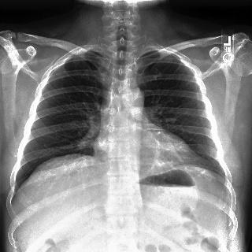</th>
        <th colspan="2">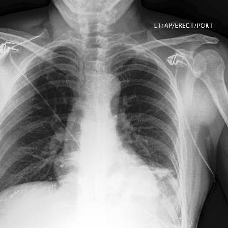</th>
        <th colspan="2">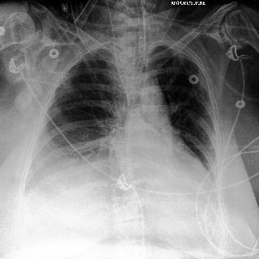</th>
    </tr><tr></tr>
    <tr>
        <th>XAI Methods</th>
        <th>Orginal Interpretation</th> <th>Tampered Interpretation</th>
        <th>Orginal Interpretation</th> <th>Tampered Interpretation</th>
        <th>Orginal Interpretation</th> <th>Tampered Interpretation</th>
    </tr>
    <tr>
        <td> Vanilla Grad </td>
        <td align="center">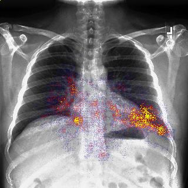</td>
        <td align="center">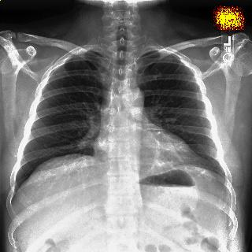</td>
        <td align="center">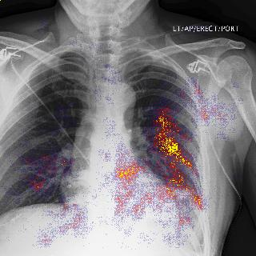</td>
        <td align="center">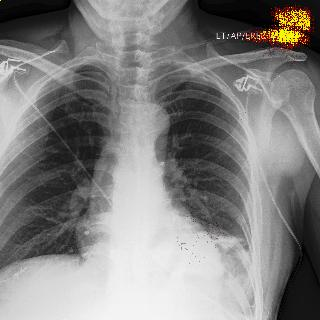</td>
        <td align="center">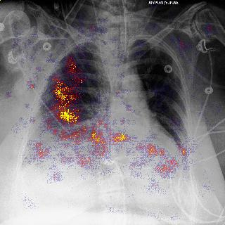</td>
        <td align="center">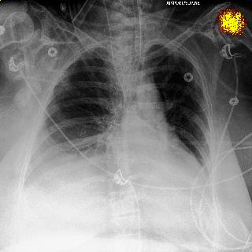</td>
    </tr>
    <tr>
        <td> Grad x Input </td>
        <td align="center">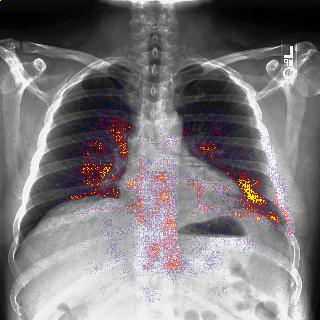</td>
        <td align="center"></td>
        <td align="center">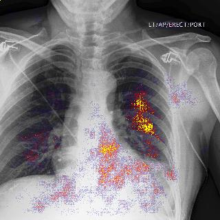</td>
        <td align="center"></td>
        <td align="center">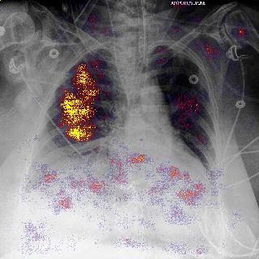</td>
        <td align="center"></td>
    </tr>
    <tr>
        <td> GradCAM </td>
        <td align="center">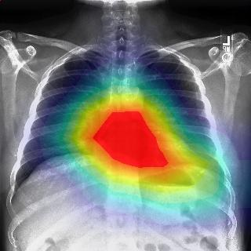</td>
        <td align="center">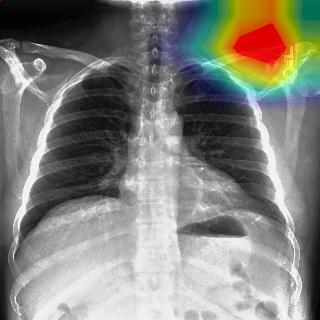</td>
        <td align="center">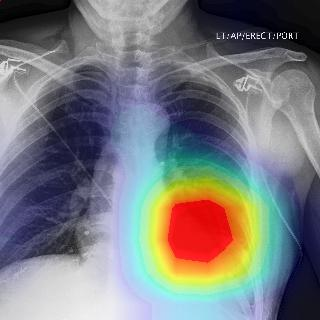</td>
        <td align="center">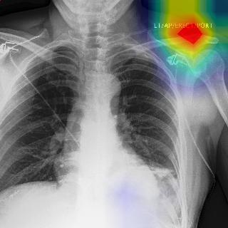</td>
        <td align="center">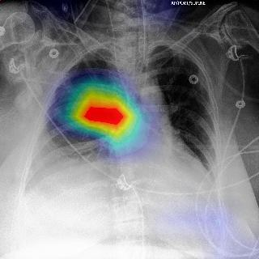</td>
        <td align="center">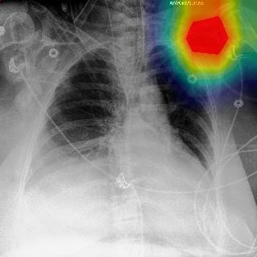</td>
    </tr>
    <tr>
        <td> Guided GradCAM </td>
        <td align="center">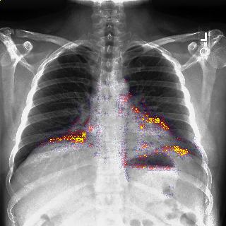</td>
        <td align="center">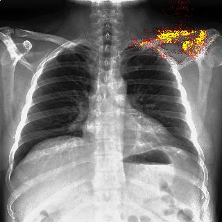</td>
        <td align="center"></td>
        <td align="center">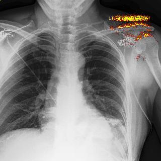</td>
        <td align="center">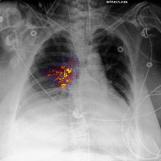</td>
        <td align="center">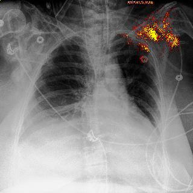</td>
    </tr>
    <tr>
        <td> IG </td>
        <td align="center">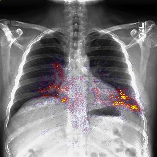</td>
        <td align="center">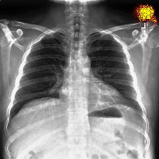</td>
        <td align="center">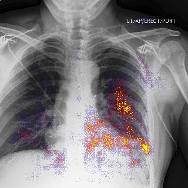</td>
        <td align="center">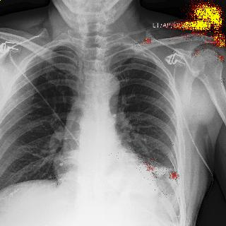</td>
        <td align="center">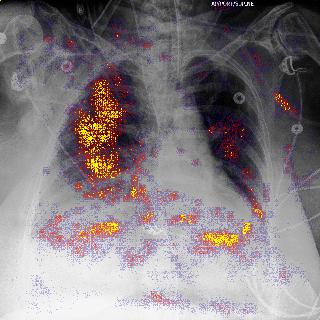</td>
        <td align="center"></td>
    </tr>
    <tr>
        <td> SG </td>
        <td align="center">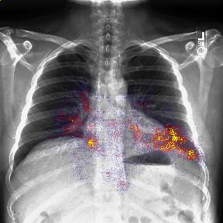</td>
        <td align="center"></td>
        <td align="center">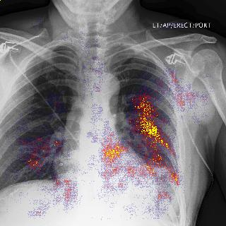</td>
        <td align="center"></td>
        <td align="center">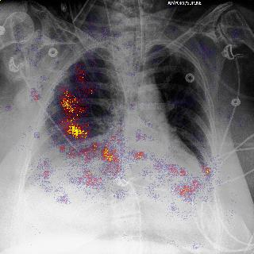</td>
        <td align="center">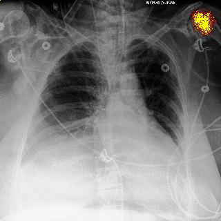</td>
    </tr>
    <tr>
        <td> XRAI </td>
        <td align="center">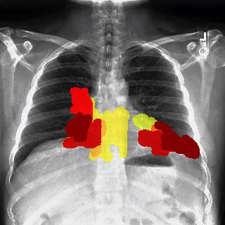</td>
        <td align="center">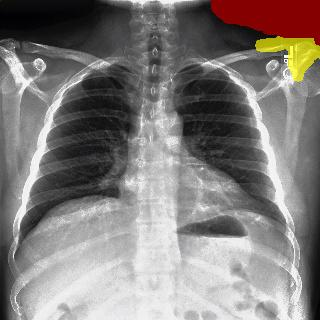</td>
        <td align="center">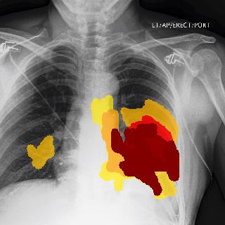</td>
        <td align="center">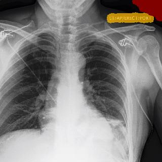</td>
        <td align="center">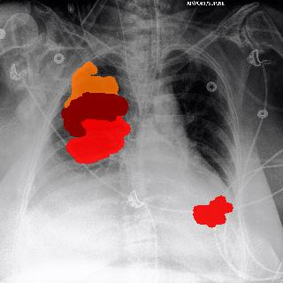</td>
        <td align="center">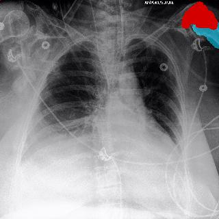</td>
    </tr>
</table>

## More Quantitative Results

### Model Prediction Performance on 5 Categories

This table shows the model performances (AUCs) on images generated by attacking different XAI methods. The AI model's predictions remain consistent between the original image and adversarial images.

| XAI Methods Attacked | Atelectasis | Cardiomegaly | Consolidation | Edema | Pleural Effusion |
| :--- | :----: | :----: | :----: | :----: |:----: |
|Original Image (w/o attack)|0.837|0.856|0.913|0.935|0.932|
|Vanilla Grad|0.829|0.839|0.909|0.930|0.931|
|Vanilla Grad x Input|0.827|0.834|0.892|0.928|0.927|
|GradCAM|0.812|0.816|0.889|0.921|0.912|
|Guided-GradCAM|0.812|0.816|0.889|0.921|0.912|
|IG|0.832|0.830|0.895|0.926|0.929|
|SG|0.833|0.845|0.898|0.932|0.925|
|XRAI|0.832|0.830|0.895|0.926|0.929|

### Images' and Saliency Maps' Similarity Before and After Attack

Besides the structural similarity index measure (SSIM), additional two evaluation metrics including Mean-Square Error (MSE) and Pearson Correlation Coefficient (PCC) were also used to provide to support the claim that __the tampered saliency maps are very different from the corresponding maps for the original images, while the adversarial images are very similar to the original images__. For SSIM and PCC, large values (close to 1) indicate high similarity while for MSE small values (close to 0) correspond to similar images. For fair comparison, we use the same `200` images for each explanation(saliency) method.
 
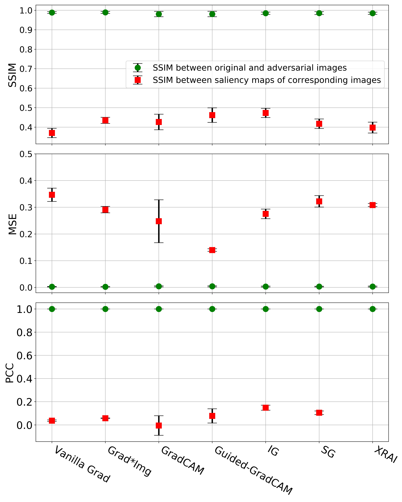
